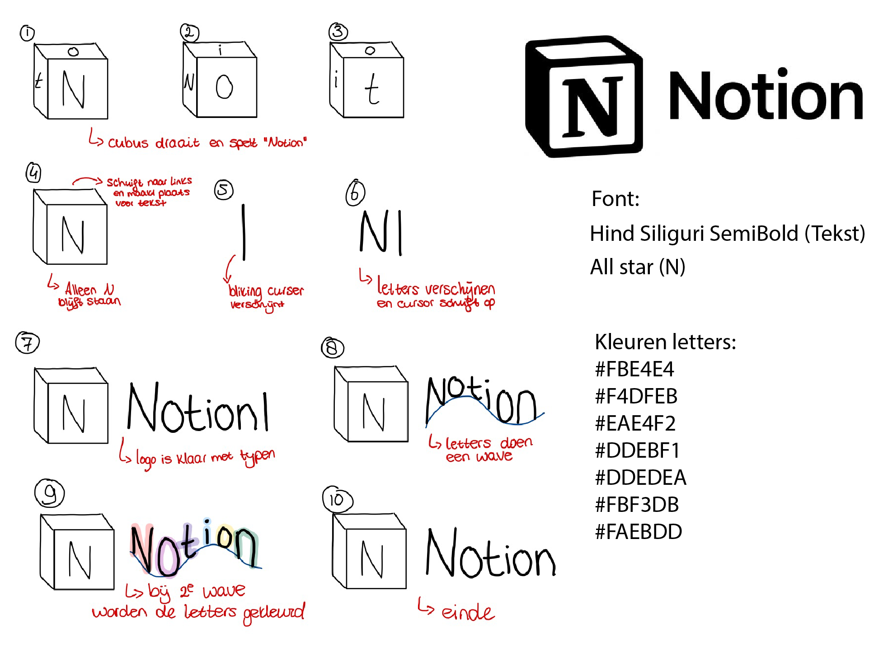
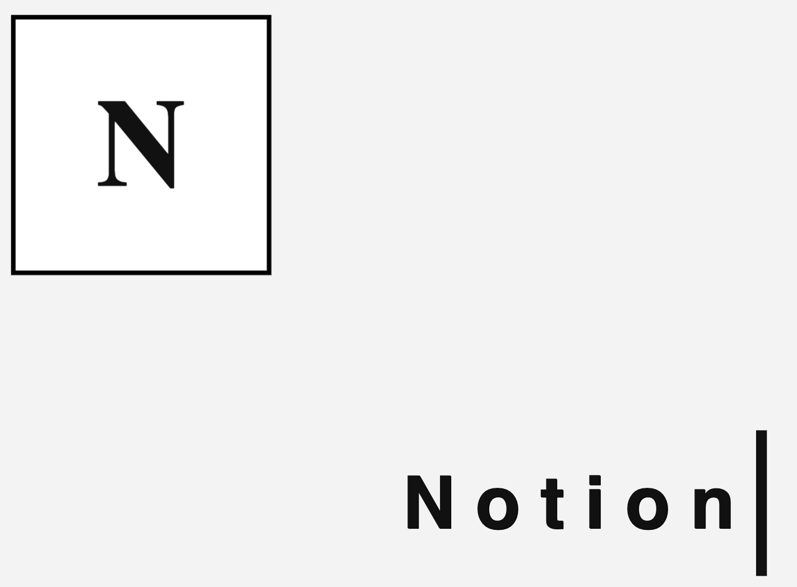
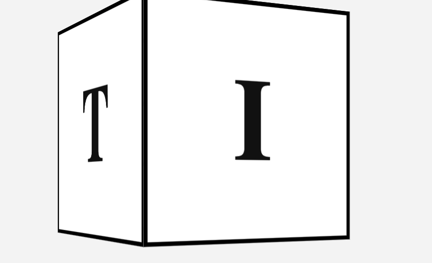
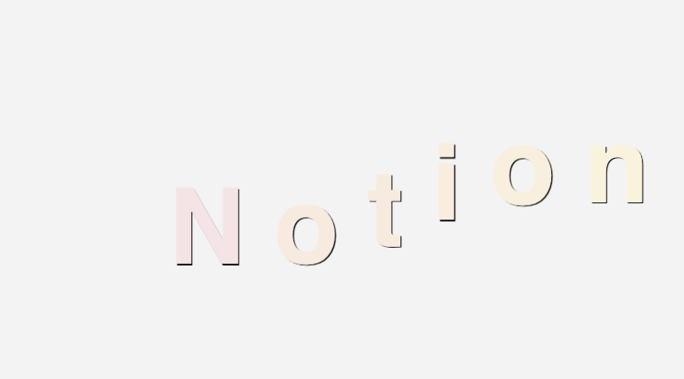
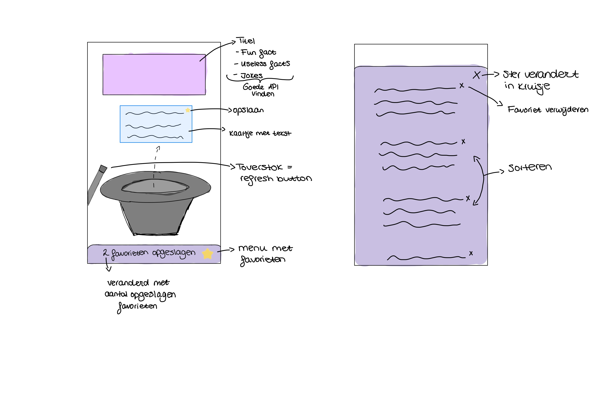

# Procesverslag
**Auteur:** Sofie Berger

**De opdrachten:** [opdracht 1](opdracht1/index.html) en [opdracht 2](opdracht2/index.html)

Markdown is een simpele manier om HTML te schrijven.  
Markdown cheat cheet: [Hulp bij het schrijven van Markdown](https://github.com/adam-p/markdown-here/wiki/Markdown-Cheatsheet).

Nb. De standaardstructuur en de spartaanse opmaak van de README.md zijn helemaal prima. Het gaat om de inhoud van je procesverslag. Besteedt de tijd voor pracht en praal aan je website.

Nb. Door *open* toe te voegen aan een *details* element kun je deze standaard open zetten. Fijn om dat steeds voor de relevante stuk(ken) te doen.

## Bronnenlijst
  1. https://developer.mozilla.org/en-US/docs/Web/CSS/CSS_Transforms/Using_CSS_transforms (kubus)
  2. https://css-tricks.com/snippets/css/typewriter-effect/ (typewritter effect)
  3. https://codepen.io/qrac/pen/MRPJLB (tekst wave)

## Opdracht 1 plan

  
uitwerken na schetsen idee (voor week 2)

  ### Je storyboard:
  

  ### Je ambitie: 
  Aan deze technieken/punten wil ik werken:
  - Meer leren over animatie
  - Kubus maken met css, en deze laten ronddraaiien.
 

## Opdracht 1 reflectie

  
uitwerken bij afronden opdracht (voor week 3)

  ### Je uitkomst - karakteristiek screenshot(s):
  

  ### Dit ging goed/Heb ik geleerd: 
  Korte omschrijving met plaatje(s)

    
  

  De kubus vind ik goed gelukt, en deze animeert ook heel mooi. In het echte Notion logo staat de kubus schijn en is de zijkant zwart, maar dat gaat nog iets te ver.
  De tekst die wordt getypt is een heel leuk effect, en past goed bij Notion.

  ### Dit was lastig/Is niet gelukt:
  Korte omschrijving met plaatje(s)

  

  Graag wilde ik dat de kubus en de tekst naast elkaar kwamen te staan, maar dit lukt niet. Ik heb veel op internet gezocht en geprobeerd, maar ben er niet uitgekomen.

## Opdracht 2 plan

  
uitwerken na schetsen idee (voor week 4)

  ### Je ontwerp:
  

  ### Je ambitie: 
  Aan deze technieken/punten wil ik werken:
  - Javascript snappen & kunnen gebruiken
  - Gebruik maken van een API
  - Favorieten kunnen opslaan in een lijst
  - Favorieten kunnen verwijderen
  - Favorieten kunnen sorteren

## Opdracht 2 test

  
uitwerken na testen (week 6/7)

  Neem minimaal 5 bevindingen op:

  ### Bevinding 1:
  Omschrijving van wat er nog niet orde was (tekst en afbeeding(en)).

  #### oplossing:
  Beschrijving hoe je het hebt hebt opgelost of als het niet gelukt is hoe je het zou oplossen (tekst en afbeeding(en)).

  ### Bevinding 2:
  Omschrijving van wat er nog niet orde was (tekst en afbeeding(en)).

  #### oplossing:
  Beschrijving hoe je het hebt hebt opgelost of als het niet gelukt is hoe je het zou oplossen (tekst en afbeeding(en)).

  ### Bevinding 3:
  ...

## Opdracht 2 reflectie

  
uitwerken bij afronden opdracht (voor week 8)

  ### Je uitkomst - karakteristiek screenshot(s):
  

  ### Dit ging goed/Heb ik geleerd: 
  Korte omschrijving met plaatje(s)

  

  ### Dit was lastig/Is niet gelukt:
  Korte omschrijving met plaatje(s)

  

